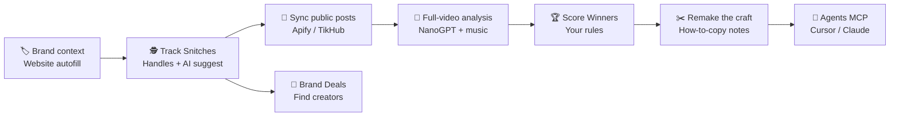
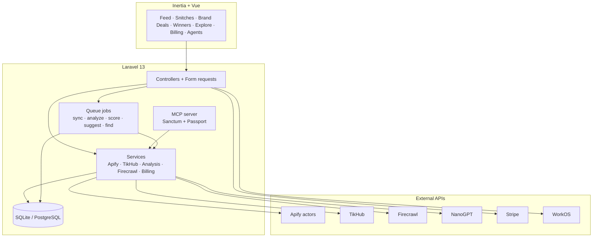

<p align="center">
  
</p>

<h1 align="center">Snitch</h1>

<p align="center">
  <strong>See what competitors post. Remake what wins.</strong><br />
  Competitor social intelligence with a soft print brain.
</p>

<p align="center">
  <a href="https://www.snitchsocial.net"></a>
  <a href="https://github.com/tmwclaxton/snitch"></a>
  <a href="https://www.snitchsocial.net/pricing"></a>
  <a href="https://www.snitchsocial.net/how-it-works"></a>
</p>

<p align="center">
  <a href="https://www.snitchsocial.net">Website</a> ·
  <a href="https://www.snitchsocial.net/pricing">Pricing</a> ·
  <a href="https://www.snitchsocial.net/agents">Agents / MCP</a> ·
  <a href="https://www.snitchsocial.net/how-it-works">How it works</a> ·
  <a href="https://www.snitchsocial.net/analytics">Analytics</a> ·
  <a href="https://github.com/tmwclaxton/snitch">GitHub</a>
</p>

<p align="center">
  
  
  
  
  
  
</p>

<p align="center">
  <a href="https://www.snitchsocial.net/analytics"></a>
  <a href="https://www.snitchsocial.net/analytics"></a>
  <a href="https://www.snitchsocial.net/analytics"></a>
</p>

<p align="center">
  <strong><a href="https://www.snitchsocial.net">Start with £5 free at www.snitchsocial.net</a></strong> - track snitches, analyze the craft, remake what clears your bar.<br />
  <sub>TikTok · Instagram · YouTube · Facebook · LinkedIn - public posts only, scored by rules you control. Agents welcome via MCP.</sub>
</p>

---

## Table of contents

**Getting started**

- [See it in action](#see-it-in-action)
- [What is Snitch?](#what-is-snitch)
- [Without vs with Snitch](#without-vs-with-snitch)
- [Who it's for](#who-its-for)
- [Snitch vs paid alternatives](#snitch-vs-paid-alternatives)
- [Pricing in plain English](#pricing-in-plain-english)
- [Quick start](#quick-start)

**Using Snitch**

- [How it works](#how-it-works)
- [Features](#features)
- [Agents and MCP](#agents-and-mcp)
- [Supported platforms](#supported-platforms)
- [Risograph design](#risograph-design)
- [Security & privacy](#security--privacy)
- [Links](#links)

**For developers**

- [Architecture](#architecture)
- [Tech stack](#tech-stack)
- [Project structure](#project-structure)
- [Getting started (local dev)](#getting-started-local-dev)
- [Key commands](#key-commands)
- [Deployment](#deployment)
- [Contributing](#contributing)
- [License](#license)

---

## See it in action

<p align="center">
  
</p>

> Soft risograph print UI: warm paper, charcoal ink, mustard spot. Sign up at [www.snitchsocial.net](https://www.snitchsocial.net) or skim [How it works](https://www.snitchsocial.net/how-it-works).

---

## What is Snitch?

Competitor research on social is a tab-hopping chore. TikTok in one window, Instagram in another, YouTube Shorts somewhere else - and still no clear answer for *what is actually working* or *why*.

**Snitch** pulls public posts from rival accounts (**Snitches**) into one contact sheet, runs full-video analysis (hook, visuals, SFX/music, transcript, core idea, how-to-copy), and scores a **Winners** tear sheet against rules you set. It also finds creators (**Brand Deals**), explores analyzed craft by taxonomy, and exposes the same loop to AI agents over **MCP** - so you spend time remaking craft, not scrolling feeds or stitching five enterprise tools together.

## Without vs with Snitch

| Without Snitch | With Snitch |
|----------------|-------------|
| Hop five apps to see what rivals shipped this week | **One contact-sheet feed** across TikTok, Instagram, YouTube, Facebook, LinkedIn |
| Guess which posts are worth stealing | **Winners board** scored by your quality rules |
| Watch a reel and forget the opening hook | **Full-video analysis** - hook, visuals, SFX/music, transcript, core idea, how-to-copy |
| Manually hunt for similar brands | **AI Snitch suggestions** from your brand context |
| Hunt creators in a separate influencer SaaS | **Brand Deals** discovery with keep / discard + sync |
| Paste website copy into a brand brief by hand | **Website autofill** for onboarding |
| Pay for seats and unused seats every month | **£5 starter**, then **£19/mo platform** + prepaid usage credits |
| Copy insights into ChatGPT by hand | **MCP tools** for Cursor, Claude.ai, and other agents |
| Purple SaaS dashboards that feel like every other tool | **Soft risograph UI** - scrap paper, polaroids, tear sheets |

## Who it's for

- **Local brands** who need a clear tear sheet of what competitors post
- **Creators** who learn by remaking winning craft, not doomscrolling
- **Small agencies** who want signal without a multi-seat enterprise suite
- **Agent builders** who want competitor intel inside Cursor / Claude via MCP
- **Developers** who prefer Laravel + Inertia + real queue jobs over demo GIFs

**Why Snitch?**

- **Signal over noise** - recent public posts, not every carousel ever uploaded
- **Craft, not vanity** - analysis explains the move, not just view counts
- **Your bar** - winner rules stay under your control
- **Honest pricing** - starter credits, then a low platform fee + pay for what you run
- **Agent-native** - the product loop is exposed as MCP tools, not just a dashboard
- **Print energy** - mustard ink on cream paper, not another indigo gradient

## Snitch vs paid alternatives

Most paid tools cover one slice of the job (benchmark dashboards, listening, or influencer CRM). Snitch is built for the remake loop: **track snitches → sync → analyze craft → score winners → (optionally) run it from an agent**.

Typical list prices below are approximate public starting points and change often - always check the vendor. Snitch numbers are the live product defaults ([pricing](https://www.snitchsocial.net/pricing)).

| Product | Best known for | Typical starting price | Gap vs Snitch |
|---------|----------------|------------------------|---------------|
| **Rival IQ** | Competitive social analytics + alerts | Hundreds $/mo (team plans) | Strong benchmarks; weak full-video remake notes + no usage-billed MCP |
| **Iconosquare** | Analytics + competitor benchmarking | Mid-tier SMB / agency seats | Reporting/scheduling heavy; not craft analysis + winners rules |
| **Flick** | Instagram hashtags + light competitor tools | ~£11-£68/mo | Cheap but IG-narrow; not five-platform snitch sync + analyze |
| **Sprout Social** | Full social suite + competitive analysis | Often $200+/seat/mo | Broad ops tool; expensive for a personal remake workflow |
| **Brandwatch** / **Talkwalker** | Enterprise social listening | Enterprise quotes | Mentions at scale; not "track these handles' reels and reverse-engineer winners" |
| **HypeAuditor** | Influencer vetting + fraud analytics | ~$299+/mo | Creator diligence; not competitor feed + winners |
| **Grin** | Ecommerce creator CRM | ~$399+/mo | Campaign management; not craft tear sheets |
| **Upfluence** / **Aspire** / **CreatorIQ** / **Traackr** | Influencer discovery + programs | Quote / enterprise | Strong for campaigns; separate from competitor content intel |
| **Semrush Influencer Analytics** | Influencer discovery add-on | Semrush suite pricing | Discovery inside SEO suite; not Snitch's sync → analyze → win loop |

### Why Snitch is better for this job

1. **One remake loop** - Snitches, feed, full-video analysis, Explore taxonomy, Winners rules, and Brand Deals live in one product instead of Rival IQ + HypeAuditor + a listening suite.
2. **Craft intelligence** - hook windows, visuals, SFX/music recognition (platform metadata + AcoustID/AudD), transcripts, Spotify links, and how-to-copy notes - not vanity charts alone.
3. **Agent-native MCP** - Cursor / Claude can suggest snitches, sync, list feed/winners, explore, and rotate tokens. Few competitors expose the product as tools with prepaid usage.
4. **Honest empty states** - sync can report `empty` when a handle has no recent reels; explore search scales with result count (0p when empty, max 0.5p).
5. **Fully open source** - AGPL-3.0 on GitHub. Inspect adapters, billing, and jobs yourself.

### Why Snitch is cheaper

| | Snitch | Typical alternatives |
|---|--------|----------------------|
| **Try it** | **£5** starter credits (no card required to claim) | Trials that still push seats / annual quotes |
| **Stay on** | **£19/mo** platform + **£30** usage credits each billing period | Rival IQ / Sprout / listening suites at hundreds per seat |
| **Extra usage** | Prepaid top-ups (£10 / £25 / £50 / £100) - pay for syncs and analyses you run | Flat seats whether you analyze 3 reels or 300 |
| **Creator find** | Brand Deals inside the same plan | Separate ~$299-$399+/mo influencer platforms |
| **Agents** | MCP included for subscribed product access | Rare; usually custom API + enterprise contract |

You are not buying unused seats for a listening database you never open. After starter credits, a paid platform plan is required; top-ups alone cannot bypass the paywall. Live global tool averages on the [pricing page](https://www.snitchsocial.net/pricing) show what sync/analyze typically costs in practice.

## Pricing in plain English

| Piece | Default |
|-------|---------|
| Claim / starter bonus | **£5** once (never expires) |
| Platform subscription | **£19/mo** |
| Credits with each platform invoice | **£30** (expire at month end) |
| Credit top-ups | £10 / £25 / £50 / £100 (expire after 3 months) |
| Explore search | Scales with result count, **max 0.5p**, **0p if empty** |
| Explore view (non-tracked reel) | **0.1p** |

See [www.snitchsocial.net/pricing](https://www.snitchsocial.net/pricing) for live averages and Stripe checkout.

## Quick start

> **Recommended:** create an account at **[www.snitchsocial.net](https://www.snitchsocial.net)**, set your brand context, add a few Snitch handles, and open the feed.

### Production (www.snitchsocial.net)

1. **[Sign up](https://www.snitchsocial.net)** with WorkOS AuthKit
2. Complete **onboarding** (brand + optional website autofill)
3. **Add Snitches** (or confirm AI suggestions)
4. Optionally run **Brand Deals** to find creators worth keeping
5. Open **Feed**, **Explore**, and **Winners** as sync and analysis finish
6. Connect **Agents / MCP** if you want Cursor or Claude on the same loop

### From source (developers)

```bash
git clone https://github.com/tmwclaxton/snitch.git
cd snitch
composer run setup
composer run dev
```

See [Getting started (local dev)](#getting-started-local-dev) for env keys and Sail.

---

## How it works



| Step | What happens |
|------|--------------|
| **1. Brand** | Describe your brand or paste a website. Firecrawl + NanoGPT autofill profile fields and own handles. |
| **2. Track Snitches** | Add rival accounts on five platforms, or run AI suggest (niche search → LLM shortlist → profile resolve). Confirm only when the run completes (or pass `allow_partial`). |
| **3. Sync** | Queue jobs pull recent public reels/posts (recency window + per-account cap + min sync interval). Empty windows report `empty`, not fake success. |
| **4. Analyze** | Video posts get hook, visuals, SFX/music recognition, transcript, CTA, core idea, and how-to-copy. |
| **5. Win** | Your rules score the board. Open a tear sheet of remake-worthy posts with why they cleared the bar. |
| **6. Brand Deals** | Optional: find creators, keep or discard, then sync the ones you keep. |
| **7. Agents** | Optional: drive the same loop from Cursor / Claude via MCP (Sanctum token or Passport OAuth for Claude.ai). |

Loop: **Track → Analyze → Win** (plus Brand Deals and MCP when you need them).

## Features

| Module | Feature | What it does |
|--------|---------|--------------|
| **Onboarding** | Brand profile | Name, description, niche, own handles |
| **Onboarding** | Website autofill | Firecrawl scrape + NanoGPT field extraction |
| **Snitches** | Tracked accounts | Add, sync, remove rivals at `/snitches` (legacy `/competitors` redirects) |
| **Snitches** | AI suggestions | Niche-led search → NanoGPT candidates → profile resolve; suggest modal with platforms + brief |
| **Snitches** | Confirm / dismiss | Confirm only when suggest is complete (unless `allow_partial`); weak generic handles rejected |
| **Brand Deals** | Influencer find | Search creators, keep / discard (and batch), sync kept accounts, follower counts |
| **Feed** | Contact sheet | Unified public posts, filters, lazy embeds, proof-frame cards, winner trophy tags |
| **Feed** | Post detail | Polaroid frame + analysis stickers, transcript viewer, Spotify embed when music matches |
| **Analysis** | Full-video pass | Hook, visuals, SFX, music (platform → AcoustID → AudD), idea, how-to-copy |
| **Explore** | Term catalogue | Browse analyzed content by inferred taxonomy; deferred shell for fast filters |
| **Explore** | Fair search billing | Charge scales with result count (max 0.5p; 0p when empty) |
| **Winners** | Rule scoring | Tear sheet of posts that clear your bar; deferred list for fast paint |
| **Winners** | Rescore | Re-run scoring when rules or analyses change |
| **Billing** | Hybrid credits | £5 starter, £19/mo platform, usage credits, top-ups, credit expiry, hard paywall |
| **Billing** | Live averages | Pricing page shows global tool cost averages from real ledger data |
| **Agents** | MCP server | Tools for brand, snitches, influencers, feed, explore, winners, billing, workflow guide |
| **Agents** | Auth | Sanctum MCP tokens for Cursor; Passport OAuth for Claude.ai connector |
| **Dashboard** | Ops snapshot | Volume, platform mix, heatmap, recent posts (deferred activity) |
| **Analytics** | Public totals | Aggregate posts / analyses / winners ([JSON](https://www.snitchsocial.net/analytics.json)) |
| **Auth** | WorkOS AuthKit | Sign-in without rolling your own identity stack |

## Agents and MCP

Snitch is agent-ready. Authenticated MCP exposes the product loop (brand, snitches, Brand Deals, feed, explore, winners, billing status, `workflow_guide`) so Cursor and Claude can run discovery without living in the browser.

| Piece | Detail |
|-------|--------|
| **URL** | `https://www.snitchsocial.net/mcp` (local: `APP_URL/mcp`) |
| **Cursor / agents** | Sanctum personal access token from [Agents](https://www.snitchsocial.net/agents) |
| **Claude.ai** | Passport OAuth connector |
| **Guide** | Call `workflow_guide` first; queued tools default to `wait_seconds=0` for Claude.ai |
| **Paywall** | Product tools respect the same credit / platform gates as the web app (402 when blocked) |
| **Admin** | Admin overview stays web-only - MCP admin tools are rejected |

Local tip: `php artisan serve` is single-threaded. A long MCP `tools/call` can stall the browser until it finishes - pause MCP or wait for the tool.

## Supported platforms

One feed for the public posts that matter:

<table>
  <tr>
    <td valign="top"> TikTok</td>
    <td valign="top"> Instagram</td>
    <td valign="top"> YouTube</td>
    <td valign="top"> Facebook</td>
    <td valign="top"> LinkedIn</td>
  </tr>
</table>

Sync is cost-disciplined by default: last **30 days**, up to **12** posts per account, and a **7-day** minimum interval between successful syncs (configurable in `config/snitch.php`).

## Risograph design

Soft, inky print energy - zine / editorial poster, not stiff SaaS.

| Token | Role |
|-------|------|
| Warm paper `#EFE6D8` | Uncoated stock ground |
| Charcoal `#1C1B1A` | Primary ink |
| Mustard `#F0C400` | Spot accent / misregistration |
| Teal `#3A5F6B` | Optional third mist |

Display: **Young Serif**. Body: **Figtree**. Annotation: **Caveat**.

UI metaphors: scrap filters, polaroid frames, contact sheets, tear-board winners, sticker annotations. Logo mark: cartoon detective mascot (`public/images/brand/mascot-mark.png`) - white coat, sunglasses, yellow hat band.

## Security & privacy

- **Your account** - WorkOS authentication; delete from settings when you are done.
- **Public posts only** - Snitch syncs publicly available snitch/creator content via Apify / TikHub. It is not a private-inbox spy tool.
- **Hard paywall** - when blocked, safe GETs still render the shell but omit product data server-side (no Billing redirect for Explore search).
- **AI processing** - brand autofill, snitch suggest, influencer find, and video analysis send text/video context to NanoGPT as needed. Firecrawl is used for website and discovery search.
- **MCP auth split** - Sanctum tokens for agents; Passport OAuth for Claude.ai. Rotate revokes Sanctum MCP tokens only.
- **No data selling** - see the [privacy policy](https://www.snitchsocial.net/privacy).
- **Fully open source** - AGPL-3.0 application code on GitHub. Inspect adapters, jobs, and analysis pipeline yourself.
- **Live probes off by default** - `SNITCH_LIVE_APIFY`, `SNITCH_LIVE_VIDEO`, and related flags stay `0` locally so tests do not burn API credits.

## Links

| | |
|---|---|
| **Website** | [www.snitchsocial.net](https://www.snitchsocial.net) |
| **Pricing** | [www.snitchsocial.net/pricing](https://www.snitchsocial.net/pricing) |
| **Agents / MCP** | [www.snitchsocial.net/agents](https://www.snitchsocial.net/agents) |
| **Dashboard** | [www.snitchsocial.net/dashboard](https://www.snitchsocial.net/dashboard) |
| **How it works** | [www.snitchsocial.net/how-it-works](https://www.snitchsocial.net/how-it-works) |
| **Analytics** | [www.snitchsocial.net/analytics](https://www.snitchsocial.net/analytics) ([JSON](https://www.snitchsocial.net/analytics.json)) |
| **About** | [www.snitchsocial.net/about](https://www.snitchsocial.net/about) |
| **Privacy** | [www.snitchsocial.net/privacy](https://www.snitchsocial.net/privacy) |
| **Contact** | [www.snitchsocial.net/contact](https://www.snitchsocial.net/contact) · [hello@snitchsocial.net](mailto:hello@snitchsocial.net) |
| **GitHub** | [github.com/tmwclaxton/snitch](https://github.com/tmwclaxton/snitch) |

---

## Architecture



| Component | Role |
|-----------|------|
| `app/Services/Apify/` / `TikHub/` | Platform adapters for profile resolve and post sync |
| `app/Services/Analysis/` | NanoGPT video analysis, music recognition, transcripts |
| `app/Services/Firecrawl/` | Website scrape and discovery search |
| `app/Services/Competitors/` | Snitch suggestion pipeline and tracked-account helpers |
| `app/Services/Influencers/` | Brand Deals discovery |
| `app/Services/Billing/` | Usage credits, paywall, explore fees, Stripe sync |
| `app/Services/Winners/` | Rule scoring for the remake board |
| `app/Mcp/` | Snitch MCP tools + workflow guide |
| `app/Jobs/` | Sync, analyze, score, suggest, influencer find, autofill |
| `config/snitch.php` / `billing.php` | Sync windows, adapters, credit / platform knobs |

## Tech stack

| Layer | Technology |
|-------|------------|
| Backend | Laravel 13, PHP 8.5 |
| Frontend | Inertia v3, Vue 3, TypeScript, Tailwind CSS v4 |
| State | Pinia |
| Auth | Laravel WorkOS (AuthKit) |
| API / MCP auth | Sanctum (agent tokens) + Passport (Claude.ai OAuth) |
| Billing | Laravel Cashier / Stripe (platform + credit packs) |
| Routing DX | Laravel Wayfinder (typed TS route helpers) |
| Scraping | Apify primary until ~$49/mo COGS, then TikHub for IG/TT/YT/LI; Facebook always Apify |
| Web intel | Firecrawl |
| LLM / video | NanoGPT (analysis, autofill, suggest, influencer find, winner copy) |
| Music | Platform metadata, then AcoustID / AudD fallbacks |
| Queues | Database locally; Redis in Sail / production |
| Local DB | SQLite by default; PostgreSQL via Sail |
| Icons | Lucide + Font Awesome |

## Project structure

```
snitch/
├── app/
│   ├── Console/Commands/       # sync-accounts, probes, analytics backfill
│   ├── Http/Controllers/       # feed, snitches, influencers, winners, explore, billing, agents, admin
│   ├── Jobs/                   # sync, analyze, score, suggest, influencer find, autofill
│   ├── Mcp/                    # Snitch MCP server + tools
│   ├── Models/                 # User, Post, TrackedAccount, Winner, …
│   └── Services/               # Apify, TikHub, Analysis, Firecrawl, Competitors, Influencers, Billing, Winners
├── config/snitch.php           # NanoGPT, Firecrawl, Apify, TikHub, sync, analysis knobs
├── config/billing.php          # Platform fee, credits, explore fees, credit packs
├── database/                   # migrations, factories, analysis term data
├── resources/js/
│   ├── pages/                  # Welcome, feed, competitors (Snitches UI), influencers, winners, explore, billing, agents, admin, marketing/*
│   ├── components/             # app shell + marketing + analytics + agents
│   └── layouts/                # Public + app layouts
├── public/images/
│   ├── brand/mascot-mark.png   # Logo mark
│   ├── marketing/              # hero, og, empty states
│   └── platforms/              # TikTok … LinkedIn SVGs
├── tests/                      # PHPUnit feature + unit coverage
├── compose.yaml                # Sail: PHP 8.5, Postgres, Redis, queue, scheduler
└── deploy/                     # Production env example
```

## Getting started (local dev)

### Prerequisites

- PHP 8.3+ (8.5 recommended; Sail image is 8.5)
- Composer
- Node.js 20+, npm
- SQLite (default) or PostgreSQL

### Install

```bash
git clone https://github.com/tmwclaxton/snitch.git
cd snitch

cp .env.example .env
composer install
npm install

php artisan key:generate
php artisan migrate
npm run build
```

Or one-shot:

```bash
composer run setup
```

### Environment

Copy `.env.example` to `.env` and configure what you need:

```env
APP_NAME=Snitch
APP_URL=http://localhost

# WorkOS - required for login
WORKOS_CLIENT_ID=
WORKOS_API_KEY=
WORKOS_REDIRECT_URL="${APP_URL}/authenticate"

# NanoGPT - analysis, autofill, suggest
NANOGPT_API_KEY=

# Firecrawl - website autofill + snitch / creator discovery
FIRECRAWL_API_KEY=

# Stripe - platform subscription + credit packs (Cashier)
STRIPE_KEY=
STRIPE_SECRET=
STRIPE_WEBHOOK_SECRET=
STRIPE_PRICE_PLATFORM=
STRIPE_PRICE_CREDITS_10=
STRIPE_PRICE_CREDITS_25=

# Apify - profile resolve + post sync (primary until monthly COGS cap)
APIFY_TOKEN=
SNITCH_APIFY_MONTHLY_CAP_USD=49

# TikHub - IG/TT/YT/LI fallback after Apify monthly COGS cap (Facebook stays Apify)
TIKHUB_API_KEY=
TIKHUB_BASE_URL=https://api.tikhub.io

# Keep live probes off unless you intend to spend credits
SNITCH_LIVE_APIFY=0
SNITCH_LIVE_TIKHUB=0
SNITCH_LIVE_VIDEO=0
SNITCH_LIVE_ANALYSIS_MATRIX=0
SNITCH_LIVE_E2E=0
```

### Run locally

```bash
composer run dev
```

Starts the Laravel server (`php artisan serve`), queue worker, log tail (Pail), and Vite together.

`artisan serve` is single-threaded: a long local MCP `tools/call` can stall browser pages (dashboard, etc.) until it finishes. Pause MCP or wait for the tool if the UI hangs. Production uses nginx + php-fpm with multiple workers.

With Sail:

```bash
./vendor/bin/sail up -d
./vendor/bin/sail npm run dev
```

Visit [http://localhost:8000](http://localhost:8000) (or your Sail URL).

> Frontend changes need `npm run dev` or `npm run build` - otherwise Vite manifest errors are expected.

## Key commands

| Command | Purpose |
|---------|---------|
| `composer run setup` | Install PHP + JS, `.env`, key, migrate, build |
| `composer run dev` | Serve + queue + Pail + Vite |
| `composer test` | Pint check + full PHPUnit suite |
| `vendor/bin/pint --dirty` | Format dirty PHP files |
| `npm run lint:check` | ESLint |
| `npm run types:check` | TypeScript |
| `php artisan snitch:sync-accounts` | Ops only: enqueue syncs past min interval (not user-scheduled) |
| `php artisan snitch:backfill-analytics` | Rebuild public analytics counters |
| `php artisan snitch:backfill-analysis-terms` | Infer explore catalogue terms |
| `php artisan snitch:probe-apify` | Live Apify adapter probe (needs live flags) |
| `php artisan snitch:probe-tikhub` | Live TikHub cost probe (needs `SNITCH_LIVE_TIKHUB`) |
| `php artisan snitch:probe-video-analysis` | Live NanoGPT analysis probe |
| `php artisan snitch:probe-e2e` | End-to-end live probe |

Focused tests while developing:

```bash
php artisan test --compact --filter=Competitor
php artisan test --compact tests/Feature/FeedControllerTest.php
```

## Deployment

Production runs on a self-hosted Docker stack (`Dockerfile` / `compose.prod.yaml`):

- Nginx + PHP-FPM app container
- Queue worker + scheduler
- PostgreSQL + Redis
- Image published to `ghcr.io/tmwclaxton/snitch`

Pushes to `main` trigger `.github/workflows/prod_deploy.yml` (build → GHCR → deploy). Canonical production URL: **[www.snitchsocial.net](https://www.snitchsocial.net)** (`APP_URL` in `deploy/env.production.example`). Cloudflare redirects apex → www.

Keep a queue worker and `schedule:work` running so sync, analysis, and winner scoring stay current.

## Contributing

Issues and pull requests welcome on [GitHub](https://github.com/tmwclaxton/snitch).

1. Fork the repo
2. Create a feature branch
3. Prefer focused PHPUnit coverage for the change
4. Run `vendor/bin/pint --dirty` and the relevant `php artisan test --compact` filter
5. If you touched JS/Vue, also run `npm run lint:check` and `npm run types:check`
6. Open a PR

Project conventions for agents and humans live in `AGENTS.md` and `.ai/rules/`.

## License

[GNU Affero General Public License v3.0 (AGPL-3.0)](https://www.gnu.org/licenses/agpl-3.0.html) (`LICENSE`, `composer.json`). Free to use, modify, and run - network use requires sharing corresponding source under the same license.

---

<p align="center">
  <strong><a href="https://www.snitchsocial.net">Get started at www.snitchsocial.net</a></strong><br />
  <sub>Built for people who ship content, or want to learn how.<br />
  Track snitches. Analyze craft. Remake the winners. Run it from an agent.</sub>
</p>
