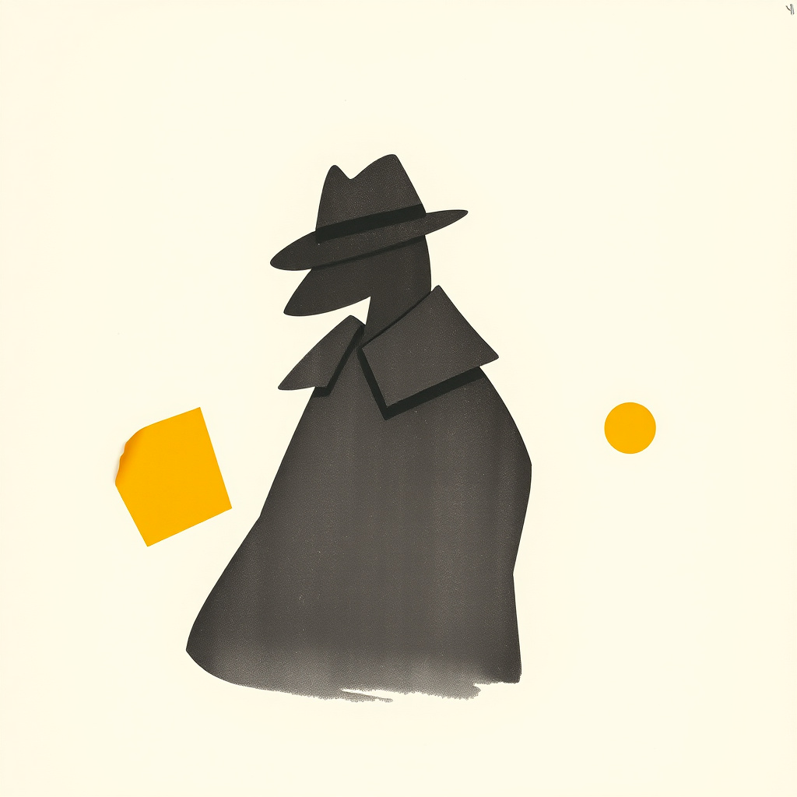
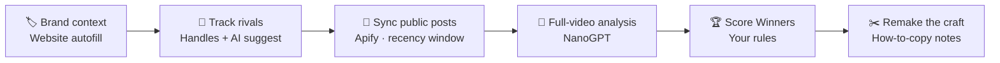
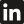
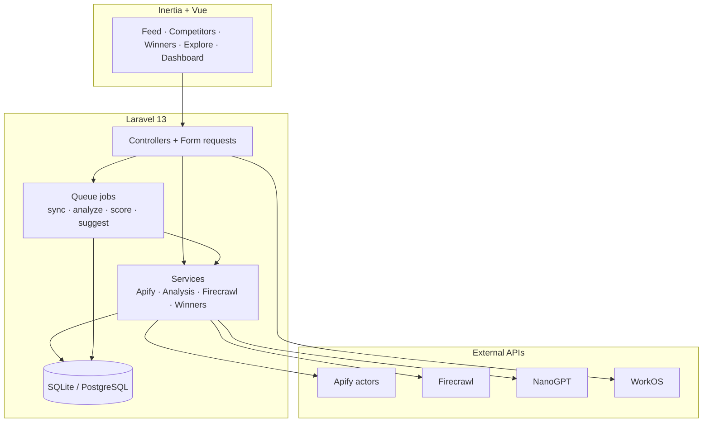

<p align="center">
  
</p>

<h1 align="center">Snitch</h1>

<p align="center">
  <strong>See what competitors post. Remake what wins.</strong><br />
  Competitor social intelligence with a soft print brain.
</p>

<p align="center">
  <a href="https://snitchsocial.net"></a>
  <a href="https://github.com/tmwclaxton/snitch"></a>
  <a href="https://snitchsocial.net/how-it-works"></a>
</p>

<p align="center">
  <a href="https://snitchsocial.net">Website</a> ·
  <a href="https://snitchsocial.net/how-it-works">How it works</a> ·
  <a href="https://snitchsocial.net/analytics">Analytics</a> ·
  <a href="https://snitchsocial.net/dashboard">Dashboard</a> ·
  <a href="https://github.com/tmwclaxton/snitch">GitHub</a>
</p>

<p align="center">
  
  
  
  
  
  
</p>

<p align="center">
  <a href="https://snitchsocial.net/analytics"></a>
  <a href="https://snitchsocial.net/analytics"></a>
  <a href="https://snitchsocial.net/analytics"></a>
</p>

<p align="center">
  <strong><a href="https://snitchsocial.net">Start free at snitchsocial.net</a></strong> - track rivals, analyze the craft, remake what clears your bar.<br />
  <sub>TikTok · Instagram · YouTube · Facebook · LinkedIn - public posts only, scored by rules you control.</sub>
</p>

---

## Table of contents

**Getting started**

- [See it in action](#see-it-in-action)
- [What is Snitch?](#what-is-snitch)
- [Without vs with Snitch](#without-vs-with-snitch)
- [Who it's for](#who-its-for)
- [Quick start](#quick-start)

**Using Snitch**

- [How it works](#how-it-works)
- [Features](#features)
- [Supported platforms](#supported-platforms)
- [Risograph design](#risograph-design)
- [Security & privacy](#security--privacy)
- [Links](#links)

**For developers**

- [Architecture](#architecture)
- [Tech stack](#tech-stack)
- [Project structure](#project-structure)
- [Getting started (local dev)](#getting-started-local-dev)
- [Key commands](#key-commands)
- [Deployment](#deployment)
- [Contributing](#contributing)
- [License](#license)

---

## See it in action

<p align="center">
  
</p>

> Soft risograph print UI: warm paper, charcoal ink, mustard spot. Sign up at [snitchsocial.net](https://snitchsocial.net) or skim [How it works](https://snitchsocial.net/how-it-works).

---

## What is Snitch?

Competitor research on social is a tab-hopping chore. TikTok in one window, Instagram in another, YouTube Shorts somewhere else - and still no clear answer for *what is actually working* or *why*.

**Snitch** pulls public posts from rival accounts into one contact sheet, runs full-video analysis (hook, visuals, SFX, core idea, how-to-copy), and scores a Winners tear sheet against rules you set - so you spend time remaking craft, not scrolling feeds.

## Without vs with Snitch

| Without Snitch | With Snitch |
|----------------|-------------|
| Hop five apps to see what rivals shipped this week | **One contact-sheet feed** across TikTok, Instagram, YouTube, Facebook, LinkedIn |
| Guess which posts are worth stealing | **Winners board** scored by your quality rules |
| Watch a reel and forget the opening hook | **Full-video analysis** - hook window, visuals, SFX/music, core idea, how-to-copy |
| Manually hunt for similar brands | **AI competitor suggestions** from your brand context (Firecrawl + NanoGPT + Apify resolve) |
| Paste website copy into a brand brief by hand | **Website autofill** for onboarding |
| Purple SaaS dashboards that feel like every other tool | **Soft risograph UI** - scrap paper, polaroids, tear sheets |

## Who it's for

- **Local brands** who need a clear tear sheet of what competitors post
- **Creators** who learn by remaking winning craft, not doomscrolling
- **Small agencies** who want signal without a multi-seat enterprise suite
- **Developers** who prefer Laravel + Inertia + real queue jobs over demo GIFs

**Why Snitch?**

- **Signal over noise** - recent public posts, not every carousel ever uploaded
- **Craft, not vanity** - analysis explains the move, not just view counts
- **Your bar** - winner rules stay under your control
- **Honest scope** - personal competitor tracker, not a team OS
- **Print energy** - mustard ink on cream paper, not another indigo gradient

## Quick start

> **Recommended:** create an account at **[snitchsocial.net](https://snitchsocial.net)**, set your brand context, add a few competitor handles, and open the feed.

### Production (snitchsocial.net)

1. **[Sign up](https://snitchsocial.net)** with WorkOS AuthKit
2. Complete **onboarding** (brand + optional website autofill)
3. **Add competitors** (or confirm AI suggestions)
4. Open **Feed**, **Explore**, and **Winners** as sync and analysis finish

### From source (developers)

```bash
git clone https://github.com/tmwclaxton/snitch.git
cd snitch
composer run setup
composer run dev
```

See [Getting started (local dev)](#getting-started-local-dev) for env keys and Sail.

---

## How it works



| Step | What happens |
|------|--------------|
| **1. Brand** | Describe your brand or paste a website. Firecrawl + NanoGPT autofill profile fields and own handles. |
| **2. Track** | Add competitor accounts on five platforms, or run AI suggest (search → LLM shortlist → Apify profile resolve). |
| **3. Sync** | Queue jobs pull recent public reels/posts (recency window + per-account cap + min sync interval). |
| **4. Analyze** | Video posts get hook, visual summary, SFX/music, CTA, core idea, and how-to-copy annotations. |
| **5. Win** | Your rules score the board. Open a tear sheet of remake-worthy posts with why they cleared the bar. |

Loop: **Track → Analyze → Win.**

## Features

| Module | Feature | What it does |
|--------|---------|--------------|
| **Onboarding** | Brand profile | Name, description, niche, own handles |
| **Onboarding** | Website autofill | Firecrawl scrape + NanoGPT field extraction |
| **Competitors** | Tracked accounts | Add, sync, remove rivals per platform |
| **Competitors** | AI suggestions | Firecrawl search → NanoGPT candidates → Apify resolve |
| **Feed** | Contact sheet | Unified public posts with filters and lazy platform embeds |
| **Feed** | Post detail | Polaroid frame + analysis stickers |
| **Analysis** | Full-video pass | Hook window, visuals, SFX, music, idea, how-to-copy |
| **Explore** | Term catalogue | Browse analyzed content by inferred taxonomy terms |
| **Winners** | Rule scoring | Tear sheet of posts that clear your bar |
| **Winners** | Rescore | Re-run scoring when rules or analyses change |
| **Dashboard** | Ops snapshot | Volume, platform mix, heatmap, recent posts |
| **Analytics** | Public totals | Aggregate posts / analyses / winners ([JSON](https://snitchsocial.net/analytics.json)) |
| **Auth** | WorkOS AuthKit | Sign-in without rolling your own identity stack |

## Supported platforms

One feed for the public posts that matter:

<table>
  <tr>
    <td valign="top"> TikTok</td>
    <td valign="top"> Instagram</td>
    <td valign="top"> YouTube</td>
    <td valign="top"> Facebook</td>
    <td valign="top"> LinkedIn</td>
  </tr>
</table>

Sync is cost-disciplined by default: last **30 days**, up to **12** posts per account, and a **7-day** minimum interval between successful syncs (configurable in `config/snitch.php`).

## Risograph design

Soft, inky print energy - zine / editorial poster, not stiff SaaS.

| Token | Role |
|-------|------|
| Warm paper `#EFE6D8` | Uncoated stock ground |
| Charcoal `#1C1B1A` | Primary ink |
| Mustard `#F0C400` | Spot accent / misregistration |
| Teal `#3A5F6B` | Optional third mist |

Display: **Young Serif**. Body: **Figtree**. Annotation: **Caveat**.

UI metaphors: scrap filters, polaroid frames, contact sheets, tear-board winners, sticker annotations. Logo mark: cartoon detective mascot (`public/images/brand/mascot-mark.png`) - white coat, sunglasses, yellow hat band.

## Security & privacy

- **Your account** - WorkOS authentication; delete from settings when you are done.
- **Public posts only** - Snitch syncs publicly available competitor content via Apify actors. It is not a private-inbox spy tool.
- **AI processing** - brand autofill, competitor suggest, and video analysis send text/video context to NanoGPT as needed. Firecrawl is used for website and discovery search.
- **No data selling** - see the [privacy policy](https://snitchsocial.net/privacy).
- **Source available** - MIT-licensed application code on GitHub. Inspect adapters, jobs, and analysis pipeline yourself.
- **Live probes off by default** - `SNITCH_LIVE_APIFY`, `SNITCH_LIVE_VIDEO`, and related flags stay `0` locally so tests do not burn API credits.

## Links

| | |
|---|---|
| **Website** | [snitchsocial.net](https://snitchsocial.net) |
| **Dashboard** | [snitchsocial.net/dashboard](https://snitchsocial.net/dashboard) |
| **How it works** | [snitchsocial.net/how-it-works](https://snitchsocial.net/how-it-works) |
| **Analytics** | [snitchsocial.net/analytics](https://snitchsocial.net/analytics) ([JSON](https://snitchsocial.net/analytics.json)) |
| **About** | [snitchsocial.net/about](https://snitchsocial.net/about) |
| **Privacy** | [snitchsocial.net/privacy](https://snitchsocial.net/privacy) |
| **Contact** | [snitchsocial.net/contact](https://www.snitchsocial.net/contact) · [hello@snitchsocial.net](mailto:hello@snitchsocial.net) |
| **GitHub** | [github.com/tmwclaxton/snitch](https://github.com/tmwclaxton/snitch) |

---

## Architecture



| Component | Role |
|-----------|------|
| `app/Services/Apify/` | Platform adapters + client for profile resolve and post sync |
| `app/Services/Analysis/` | NanoGPT video analysis client and success checks |
| `app/Services/Firecrawl/` | Website scrape and discovery search |
| `app/Services/Competitors/` | Suggestion pipeline and tracked-account helpers |
| `app/Services/Winners/` | Rule scoring for the remake board |
| `app/Jobs/` | `SyncTrackedAccountJob`, `AnalyzePostJob`, `ScoreWinnersJob`, suggest + autofill |
| `config/snitch.php` | Models, sync windows, live-probe flags |

## Tech stack

| Layer | Technology |
|-------|------------|
| Backend | Laravel 13, PHP 8.5 |
| Frontend | Inertia v3, Vue 3, TypeScript, Tailwind CSS v4 |
| State | Pinia |
| Auth | Laravel WorkOS (AuthKit) |
| Routing DX | Laravel Wayfinder (typed TS route helpers) |
| Scraping | Apify primary until ~$49/mo COGS, then TikHub for IG/TT/YT/LI; Facebook always Apify |
| Web intel | Firecrawl |
| LLM / video | NanoGPT (analysis, autofill, suggest, winner copy) |
| Queues | Database locally; Redis in Sail / production |
| Local DB | SQLite by default; PostgreSQL via Sail |
| Icons | Lucide + Font Awesome |

## Project structure

```
snitch/
├── app/
│   ├── Console/Commands/       # sync-accounts, probes, analytics backfill
│   ├── Http/Controllers/       # feed, competitors, winners, explore, marketing
│   ├── Jobs/                   # sync, analyze, score, suggest, autofill
│   ├── Models/                 # User, Post, TrackedAccount, Winner, …
│   └── Services/               # Apify, Analysis, Firecrawl, Competitors, Winners
├── config/snitch.php           # NanoGPT, Firecrawl, Apify, sync, analysis knobs
├── database/                   # migrations, factories, analysis term data
├── resources/js/
│   ├── pages/                  # Welcome, feed, winners, explore, marketing/*
│   ├── components/             # app shell + marketing + analytics
│   └── layouts/                # Public + app layouts
├── public/images/
│   ├── brand/mascot-mark.png   # Logo mark
│   ├── marketing/              # hero, og, empty states
│   └── platforms/              # TikTok … LinkedIn SVGs
├── tests/                      # PHPUnit feature + unit coverage
├── compose.yaml                # Sail: PHP 8.5, Postgres, Redis, queue, scheduler
└── deploy/                     # Production env example
```

## Getting started (local dev)

### Prerequisites

- PHP 8.3+ (8.5 recommended; Sail image is 8.5)
- Composer
- Node.js 20+, npm
- SQLite (default) or PostgreSQL

### Install

```bash
git clone https://github.com/tmwclaxton/snitch.git
cd snitch

cp .env.example .env
composer install
npm install

php artisan key:generate
php artisan migrate
npm run build
```

Or one-shot:

```bash
composer run setup
```

### Environment

Copy `.env.example` to `.env` and configure what you need:

```env
APP_NAME=Snitch
APP_URL=http://localhost

# WorkOS - required for login
WORKOS_CLIENT_ID=
WORKOS_API_KEY=
WORKOS_REDIRECT_URL="${APP_URL}/authenticate"

# NanoGPT - analysis, autofill, suggest
NANOGPT_API_KEY=

# Firecrawl - website autofill + competitor discovery
FIRECRAWL_API_KEY=

# Apify - profile resolve + post sync (primary until monthly COGS cap)
APIFY_TOKEN=
SNITCH_APIFY_MONTHLY_CAP_USD=49

# TikHub - IG/TT/YT/LI fallback after Apify monthly COGS cap (Facebook stays Apify)
TIKHUB_API_KEY=
TIKHUB_BASE_URL=https://api.tikhub.io

# Keep live probes off unless you intend to spend credits
SNITCH_LIVE_APIFY=0
SNITCH_LIVE_TIKHUB=0
SNITCH_LIVE_VIDEO=0
SNITCH_LIVE_ANALYSIS_MATRIX=0
SNITCH_LIVE_E2E=0
```

### Run locally

```bash
composer run dev
```

Starts the Laravel server, queue worker, log tail (Pail), and Vite together.

With Sail:

```bash
./vendor/bin/sail up -d
./vendor/bin/sail npm run dev
```

Visit [http://localhost:8000](http://localhost:8000) (or your Sail URL).

> Frontend changes need `npm run dev` or `npm run build` - otherwise Vite manifest errors are expected.

## Key commands

| Command | Purpose |
|---------|---------|
| `composer run setup` | Install PHP + JS, `.env`, key, migrate, build |
| `composer run dev` | Serve + queue + Pail + Vite |
| `composer test` | Pint check + full PHPUnit suite |
| `vendor/bin/pint --dirty` | Format dirty PHP files |
| `npm run lint:check` | ESLint |
| `npm run types:check` | TypeScript |
| `php artisan snitch:sync-accounts` | Ops only: enqueue syncs past min interval (not user-scheduled) |
| `php artisan snitch:backfill-analytics` | Rebuild public analytics counters |
| `php artisan snitch:backfill-analysis-terms` | Infer explore catalogue terms |
| `php artisan snitch:probe-apify` | Live Apify adapter probe (needs live flags) |
| `php artisan snitch:probe-tikhub` | Live TikHub cost probe (needs `SNITCH_LIVE_TIKHUB`) |
| `php artisan snitch:probe-video-analysis` | Live NanoGPT analysis probe |
| `php artisan snitch:probe-e2e` | End-to-end live probe |

Focused tests while developing:

```bash
php artisan test --compact --filter=Competitor
php artisan test --compact tests/Feature/FeedControllerTest.php
```

## Deployment

Production runs on a self-hosted Docker stack (`Dockerfile` / `compose.prod.yaml`):

- Nginx + PHP-FPM app container
- Queue worker + scheduler
- PostgreSQL + Redis
- Image published to `ghcr.io/tmwclaxton/snitch`

Pushes to `main` trigger `.github/workflows/prod_deploy.yml` (build → GHCR → deploy). Production URL: **[snitchsocial.net](https://snitchsocial.net)** (`APP_URL` in `deploy/env.production.example`).

Keep a queue worker and `schedule:work` running so sync, analysis, and winner scoring stay current.

## Contributing

Issues and pull requests welcome on [GitHub](https://github.com/tmwclaxton/snitch).

1. Fork the repo
2. Create a feature branch
3. Prefer focused PHPUnit coverage for the change
4. Run `vendor/bin/pint --dirty` and the relevant `php artisan test --compact` filter
5. If you touched JS/Vue, also run `npm run lint:check` and `npm run types:check`
6. Open a PR

Project conventions for agents and humans live in `AGENTS.md` and `.ai/rules/`.

## License

[MIT](https://opensource.org/licenses/MIT) (`composer.json`). Free to use, modify, and ship - including commercially - with attribution preserved.

---

<p align="center">
  <strong><a href="https://snitchsocial.net">Get started at snitchsocial.net</a></strong><br />
  <sub>Built for people who ship content, or want to learn how.<br />
  Track. Analyze. Remake the winners.</sub>
</p>
